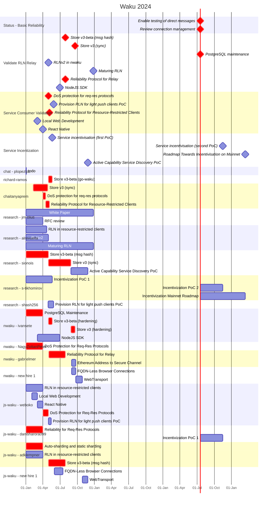

# Waku Roadmap 2024 Gantt Charts

The aim of those charts is to provide a visual on the 2024 milestones, contributor work and completion dates.
In **red** are the critical path for Status app short term goals.

**Note the contributor assignments may not exactly match reality.**
**This is still a draft.**

