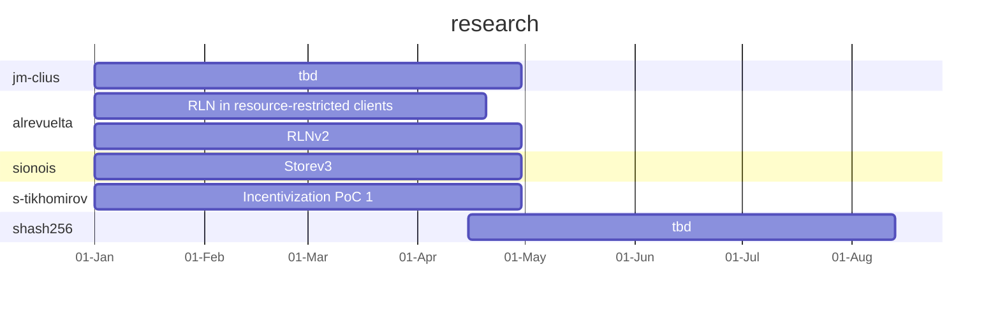
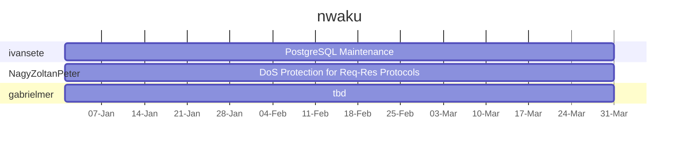
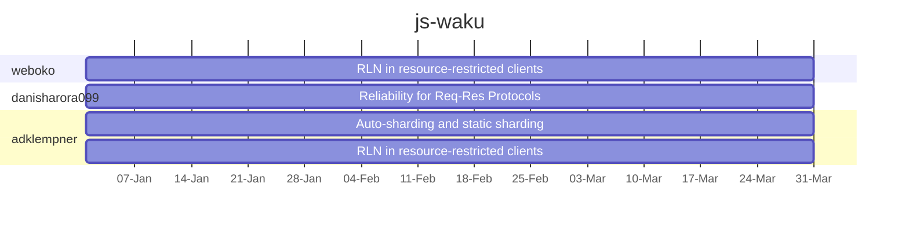

```mermaid
gantt
    title research
    dateFormat YYY-MM-DD
    axisFormat %d-%b
    
    section jm-clius
        tbd: 2024-01-01, 120d
    section alrevuelta
        RLN in resource-restricted clients: 2024-01-01, 110d
        RLNv2: 2024-01-01, 120d
    section sionois
        Storev3: pgsql, 2024-01-01, 120d
    section s-tikhomirov
        Incentivization PoC 1: i18npoc1, 2024-01-01, 120d
    section shash256
        tbd: tbd1, 2024-04-15, 120d
```

```mermaid
gantt
    title nwaku
    dateFormat YYY-MM-DD
    axisFormat %d-%b
    
    section ivansete
        PostgreSQL Maintenance: pgqsl, 2024-01-01, 90d
    section NagyZoltanPeter
        DoS Protection for Req-Res Protocols: dosreqres, 2024-01-01, 90d
    section gabrielmer
        tbd: tbd2, 2024-01-01, 90d
```

```mermaid
gantt
    title js-waku
    dateFormat YYY-MM-DD
    axisFormat %d-%b
    
    section weboko
        RLN in resource-restricted clients: rlnlight, 2024-01-01, 90d
    section danisharora099
        Reliability for Req-Res Protocols: relreqres, 2024-01-01, 90d
    section adklempner
        Auto-sharding and static sharding: shard, 2024-01-01, 90d
        RLN in resource-restricted clients: rlnlight, 2024-01-01, 90d
```
