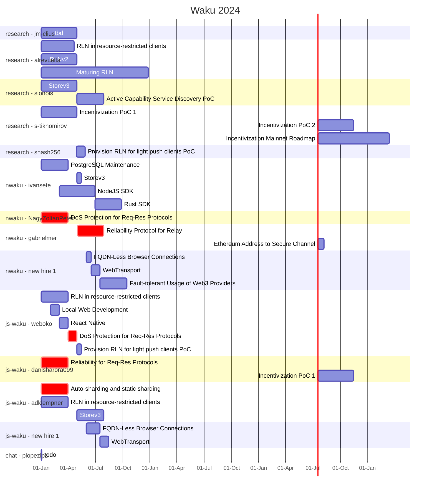

# Waku Roadmap 2024 Gantt Charts

The aim of those charts is to provide a visual on the 2024 milestones and justify the need for new hires.

Note the contributor assignments of tasks may not exactly match reality.

